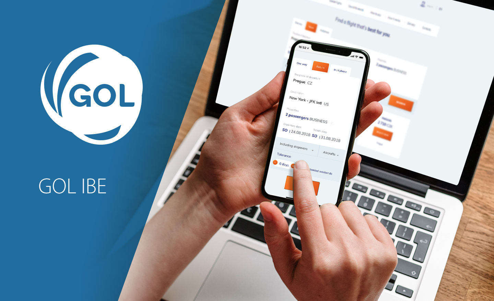

# GOL IBE – introduction

GOL IBE is an **online booking engine designed for booking of air tickets and miscellaneous travel services**. It is provided to travel agencies who can integrate it with their websites and this way offer their services online. The services can be sold thanks to the connection of GOL IBE with airlines and other sources of data. The offers are therefore up-to-date and your passengers can pay for the created bookings instantly through one of the many integrated payment gateways. GOL IBE then issues an electronic ticket. Your passengers can book their journey on your agency website without having to get in touch with your staff.

You can find more details on [http://www.cee-systems.com/gol-ibe](http://www.cee-systems.com/gol-ibe)

This guide gives you a description of the most important settings that can be done by an authorized GOL IBE user.

