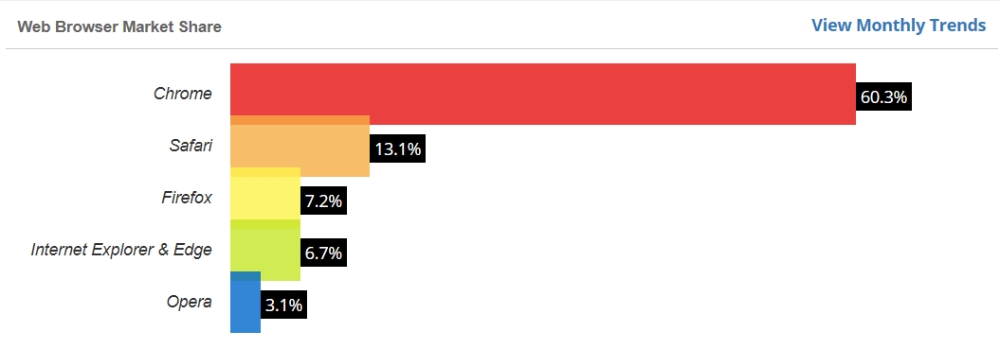
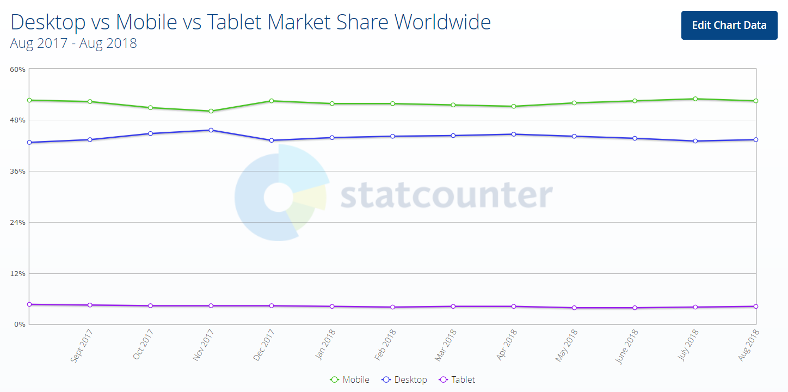

# Proven tips

We've got a few tips for you that may seem obvious, however we highly recommend that you have a look at your website and GOL IBE implementation and consider whether there's nothing which would completely unnecessarily hinder your success.

**Stop for a moment, have a look at your online booking engine and tick off diligently the following points one by one so that you have a clean conscience that you've done everything correctly just like you wanted to.**

## Search form on your website

* **Are you really selling air tickets?**

Have a look at the homepage of your website through the eyes of your customer who wants buy an air ticket. Can they clearly see that you offer air tickets at all? Can you see that on your website?

* **Is the search form implemented correctly?**

Check whether the search form is implemented correctly and that it is visible entirely. It not scarcely happens that the button _Search_ is not visible or some elements of the form don't work as they should. That's a roadblock your customers won't get through, whatever traffic your website gets. Is everything displayed correctly?

* **Can your customers see everything correctly in the most frequently used browsers?**

Take a look at the statistics below which show how browsers are used. The statistics can be different by country and can change in time. You definitely won't make a mistake however, if you focus on the 5 major browsers and try out how they display your website and search form. If you need to precisely measure which browsers are used most frequently by your customers, start using a service such as [Google Analytics](https://marketingplatform.google.com/about/analytics/). Your web designers can certainly help you with that, and you'll be able to consider the return on your investment better along with adjusting your website to all the browsers versus the website traffic.

* **Is your website correctly displayed to all your customers?**

Be careful about adding too many measurements, third-party applications for customer communication, and loading information from Facebook etc. Some of those services may not be fine tuned and in some cases you may risk that if one of them doesn't work correctly all of a sudden and it doesn't respond quickly enough, they may delay loading of some parts of your website by up to several minutes. It does not happen often, but it may happen. Our recommendation therefore is that you test your website continuously, even on an older, slowlier computer for which a richer website can be a bigger challenge.

* **Is your website mobile responsive?**

The number of users who search through their smartphones is rising. Is your website mobile responsive so that your customers can read it and possibly book air tickets? Moreover, search engines such as Google consider responsiveness of your website as a very important parameter when it comes to rating, and this may fundamentally affect the searchability of your website.

## Prodej letenek

* **Stihnou zákazníci rezervovat?**

Položte si otázku, kdy vaši zákazníci chtějí vytvářet rezervace. Jsou to pouze firemní cestující a zvládnou to v běžné pracovní době? Nebo jsou to jednotlivci, kteří chtějí rezervovat večer, nebo o víkendu? Velké množství jich skutečně rezervuje i v nekomerčních časech. V zaměstnání se podívají a rezervují večer, po dohodě s rodinou, nebo tehdy kdy budou mít více času plánovat cestu. Máte nastaveno omezení pracovní doby vaší on-line aplikace? Neztratíte klienty, pokud budou vědět že je aplikace obslouží jen někdy? Víme, že je to obtížné, ale pokud se rozhodnete mít na webu otevřeno 24x7, pak můžeme nastavit notifikace o tom, že se někdo vytvořil rezervaci, pokud je k dispozici platební brána, může zákazník zaplatit a automaticky si nechat vystavit letenku. E-mailová upozornění pak mohou chodit, jen pokud se nepodaří letenku automaticky vystavit apod.

* **Stihnou zákazníci zaplatit?**

Garance ceny je standardně v rezervačních systémech jen den a i když podmínky tarifu často hovoří o delším čase, může se cena změnit. Nebo vám airline ráda pošle do rezervace zprávu, že musíte vystavit letenku ihned. Nabízí se velmi oblíbené řešení nastavit termín vystavení na ihned, nebo do druhého dne. Ale pozor, nemáte-li on-line platební bránu, skutečně vám někdo stačí zaplatit hotově nebo převodem? Pokud ne, nevybere si jiný on-line?

* **Jak srovnatelné jsou vaše výsledky s konkurencí?**

S výsledky se dá různě nakládat, podle toho jakou máte klientelu. Můžete jim nabízet:

* kratší přestupy \(GOL IBE umožňuje nastavit maximální dobu přestupu na krátké a dlouhé tratě\)
* unikátní výsledky \(V backoffice GOL IBE můžete nastavovat výsledky navíc s konkrétní airline, přestupem apod.\)

V neposlední řadě je ale důležité kontrolovat zobrazované ceny. Není výjimkou, že vaše konkurence může mít různě vysoké servisní poplatky pro různé airline, nebo destinace. Tam kde mají například za odměnu dosáhnout nějakého množství prodejů, budou poplatky minimální a vy můžete zjistit, že do dané destinace neprodáte vůbec nic. Jste zákazníka drazí. Je to v pořádku? Děje se vám to?

* **Vyděláváte na provizích?**

I když dnes provize od leteckých společností skoro neexistují, stále zde jsou. Jen je třeba provize ve správné výši vkládat do rezervací. Nezřídka je to ale tak složité, že se to nedělá. Není to škoda? \(GOL IBE tuto funkci má, takže i velmi složité provize lze nastavit a ty se již samy budou kalkulovat pro vytvářené rezervace\) Vystavujete letenky bez provizí?

## Marketing

* **Vědí klienti o vašich stránkách?**

Upozorňujete na existenci prodeje přes internet? Pokud jen vystavíte stránky na internet je to málo na získání klientů. Než se prosadíte, trvá to a není to snadné. Neuvažujete o tom, informovat zákazníky v emailových podpisech, propagačních materiálech, nabídkách, potvrzeních, na vizitkách atd?

* **Máte věrnostní programy?**

Funguje to všude, tak proč ne v letenkách? GOL IBE má systém přihlašování zákazníků, evidenci data jejich posledního nákupu, exporty pro zjištění četnosti nákupů a systém pro nastavení speciální výše servisního poplatku pro přihlášené uživatele. Nešlo by to nějak využít a věrné odměnit speciálním servisním poplatkem nebo nějakou úplně jinou odměnou?

