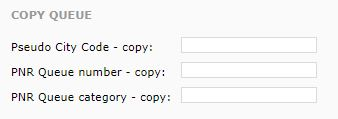

# Agency profile

Under **Agency -&gt; Agency settings**, you can change the basic settings affecting the functionality of your GOL IBE.

| Item | Description |
| :--- | :--- |
| **Time zone** | In order for some settings and calculations to function properly, it is necessary to select the correct time zone where your agency is located. This setting affects also for example calculation of your working hours. |

## Galileo settings

Here you can set up the connector for air tickets from Galileo GDS.

### Settings affecting the behaviour of air tickets

| Item | Description |
| :--- | :--- |
| **Currency** | The currency in which search results are displayed. If the currency differs from your default one set in the Galileo GDS, an exchange rate is used. The exchange rate is used to calculate the prices displayed to customers. The original prices remain in the Galileo GDS. |
| **Last ticketing date** | The date displayed to customers as the maximum date for paying for / issuing e-tickets. It is shown during the booking process and also in booking confirmations. |
|  | Based on tarif in GDS - set exactly according to fare conditions |
|  | Date of booking creation - on the same day when the booking is made |
|  | Date of booking creation +1 - the following day after the booking, if the fare conditions don't command a shorter deadline |
|  | Date of booking creation +2 up to +6 - see above |
| **Maximum number of requests on multiHAPs** | This one is related to the MultiPCC functionality and defines the maximum number of parallel requests that are sent to the GDS per one search request done by the customer \(this setting can be changed only by the system admin\) |
| **Reservation check in GDS** | Activation of the robot checking the status of bookings in the GDS. If the agent changes the ticket status through the terminal from Active to Issued/Cancelled, this status is changed also in GOL IBE. The robot runs 4 times a day. This setting can be changed only by the system admin. |
| **Start date for check** | The date from which active tickets are checked in the GDS. Before the check, the robot prepares a set of bookings between the current date and the date set in the GOL IBE back office \(inclusive\). Out of this set, it only checks those bookings for which 48 hours haven't passed yet since the date and time of arrival of the last segment. This setting can be changed only by the system admin. |
| **Don't include the surrounding airports in search results** | Here you can set whether during a search of flights to a particular airport \(eg. LHR\) GOL IBE should include search results also for other airports within the city / parent destination \(eg. LON\). |

### Settings of communication with Galileo GDS

| Item | Description |
| :--- | :--- |
| **Host Access Profile** | You need to configure a MasterGTID and create a robotic GWS sign-on withe settings Multiterminal U \(Unlimited\). With that information ready, request a HAP at API Support. DynGalileoProd or DynGalileoCopy designates whether this the Production or the Copy system. |
| **Pseudo City Code** | An agency PCC used for searching and booking. You always need to have a separate PCC, different from the one used for your agency. In AAT, set PLAT to Y and AUTH carriers or set the TKT agency. |
| **PrivateFaresAccount code** | Account Code for private fares \(ariline, agency private fares\). In case that agencies use private fares loaded under this designation. If you need to use more account codes, request a MasterAccountCode and include them there. |
| **PNR Queue number** | A Queue within the above set PCC. Created bookings are sent to this Queue. |
| **PNR Queue category** | Queue categories, in case you use them to sort messages. |

### Queues - notifications for agents in Galileo GDS

| Item | Description |
| :--- | :--- |
| **Pseudo City Code - copy** | An agency PCC where copies of created bookings are sent. |
| **PNR Queue number - copy** | A Queue within the above set PCC. Created bookings are sent to this Queue. |
| **PNR Queue category - copy** | Queue categories, in case you use them to sort messages. |

| Item | Description |
| :--- | :--- |
| **Pseudo City Code - priority** | An agency PCC where copies of bookings created on the same day are sent. This is to make sure that your agents process bookings in time, if automated ticketing is not activated. |
| **PNR Queue number - priority** | A Queue within the above set PCC. Created bookings are sent to this Queue. |
| **PNR Queue category - priority** | Queue categories, in case you use them to sort messages. |

### Settings of secondary communication with Galileo GDS

This setting is similar to the one above for the Primary HAP. A secondary HAP is used, if you have multiple PCCs with different settings and for some reason you need to search through two PCCs at the same time and to combine the results. In order for this feature to function properly, complete the settings under **Parallel search**.

| Item | Description |
| :--- | :--- |
| **Allowed Store price higher than BB maximum of** | The limit value of how much the maximum price saved in the booking may be higher than the price returned during the search. If the limit is exceeded, from customer's perspective the booking is not finished and it is cancelled in the GDS. |
| **Allowed Store price smaller than BB maximum of** | The limit value of how much the lowest price saved in the booking may be lower than the price returned during the search. If the limit is exceeded, from customer's perspective the booking is not finished and it is cancelled in the GDS. |
| **Block non e-ticketable bookings** | If checked, GOL IBE blocks bookings that cannot be e-ticketed. |
| **Block unconfirmed reservation within 5 sec** | If checked, GOL IBE blocks bookings with segments not confirmed within 5 seconds since the bookings is created. |

### Special offers settings

| Item | Description |
| :--- | :--- |
| **Maximum of automatic special offers** | When you enter a value, you activate automated saving of offers for each created booking to suggestions of special offers. You can then activate the special offers in the back office. |
| **Create automatic special offers with fixed fee** | If checked, GOL IBE automatically saves the service fee from the original bookings for the suggested special offers. |

### Settings of mandatory document information - DOCS

| Item | Description |
| :--- | :--- |
| **Countries requiring passport** | Codes of countries for which DOCS information is required \(if you enter multiple codes, you need to separate them by comma\). Entered countries require a passport, if the departure, transfer or arrival airport is in its territory. If the settings should be applied for all countries, you need to enter the code _ALL_. |
| **Carriers requiring pass** | Codes of carriers for which DOCS information is required. If the carrier is in the itinerary \(either marketing or operating\), the passenger will be required to enter their passport details regardless of the destination, ie. for all destinations operated by this carrier. If the settings should be applied for all countries, you need to enter the code _ALL_. |
| **Displayed format** | Basic - without passport number: the DOCS information is required in a simpler format. This allows the passenger to finish the booking, however the e-ticket cannot be issued. This option is most frequently used because it bothers passengers to complete all passport details and it often complicates their process of booking. It is more suitable to get their passport details additionally. |
|  | Extended - with passport number: the DOCS information is required in the full format, ie. also including the passport number. |
| **Mandatory** | If you check this option and enter any of the parameters above, the passenger cannot finish the booking without entering the DOCS information, and GOL IBE returns an error notification. |

### Settings of mandatory document information - FOID

| Item | Description |
| :--- | :--- |
| **Countries requiring passport** | Codes of countries for which FOID information is required \(if you enter multiple codes, you need to separate them by comma\). Entered countries require a passport, if the departure, transfer or arrival airport is in its territory. If the settings should be applied for all countries, you need to enter the code _ALL_. |
| **Carriers requiring passport** | Codes of carriers for which FOID information is required. If the carrier is in the itinerary \(either marketing or operating\), the passenger will be required to enter their passport details regardless of the destination, ie. for all destinations operated by this carrier. If the settings should be applied for all countries, you need to enter the code _ALL_. |
| **Mandatory** | If you check this option and enter any of the parameters above, the passenger cannot finish the booking without entering the FOID information, and GOL IBE returns an error notification. |

