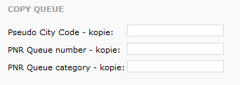

# Profil agentury

V menu **Agentura -&gt; Nastavení agentury** je možné upravit základní nastavení, ovlivňující fungování vašeho GOL IBE.

| Pole | Popis |
| :--- | :--- |
| **Časová zóna dle** | Pro správné fungování některých nastavení a výpočtů je nutné, aby byla správně zvolena časová zóna, ve které leží vaše agentura. Podle tohoto nastavení funguje například i vyhodnocování vaší pracovní doby. |

## Nastavení pro Galileo

Slouží k nastavení konektoru pro letenky z GDS Galileo

### Nastavení ovlivňující chování letenek

| Pole | Popis |
| :--- | :--- |
| **Měna** | Měna, ve které jsou zobrazovány výsledky. V případě, že se jedná o jinou měnu, než je vaše výchozí měna v Galileu, bude využíván přepočetní kurz. Tímto kurzem budou přepočítány ceny zobrazované zákazníkům. V Galileu zůstanou stále ceny původní. |
| **Max. datum pro vystavení** | Datum zobrazované zákazníkům jako maximální pro zaplacení/vystavení letenky. Zobrazuje se během rezervačního procesu i v potvrzeních o rezervaci. |
|  | Dle tarifu v GDS - nastavuje se přesně podle tarifních podmínek |
|  | Datum vytvoření rezervace - ve stejný den, kdy je vytvořena rezervace |
|  | Datum vytvoření rezervace +1 - druhý den po rezervaci, pokud tarifní podmínky neříkají kratší termín |
|  | Datum vytvoření rezervace +2 až +6 - viz výše |
| **Maximální počet dotazů na MultiHAPu** | Souvisí s funkcionalitou MultiPCC a definuje, kolik paralelních dotazů do GDS může být maximálně odesláno pro jedno hledání vyvolané Zákazníkem \(nastavení může změnit jen správce systému\) |
| **Kontrola rezervace v GDS** | Aktivace robota, který kontroluje stav rezervace letenky v GDS. Pokud byl stav letenky změněn pracovníkem agentury přes terminál z Aktivní na Vystavena/Zrušena, dojde ke změně tohoto stavu i v GOL IBE. Robot se spouští 4x denně. \(nastavení může změnit jen správce systému\) |
| **Kontrola rezervace po** | Datum, od kterého jsou aktivní letenky v GDS kontrolovány. Robot si před dotazem připraví množinu kódů rezervací, které se nacházejí mezi aktuálním datem a datem nastaveným v GOL IBE zázemí \(včetně\). Z množiny těchto rezervací se pak dotazuje pouze na ty, u kterých ještě neuplynulo 48 hodin od data a času příletu posledního segmentu. \(nastavení může změnit jen správce systému\) |
| **Nezahrnout do výsledků okolní letiště** | Nastavení, zda při vyhledávání letu do konkrétního letiště \(například LHR\), zahrnout do výsledků i ostatní letiště v rámci města/nadřazené destinace \(například LON\). |

### Nastavení komunikace s GDS Galileo

| Pole | Popis |
| :--- | :--- |
| **Host Access Profile** | Nutno vykonfigurovat MasterGTID a současně vytvořit robotický zápis GWS s nastavením Multiterminal U \(Unlimited\). Na základě těchto informací je nutné vyžádat přes APIsupport HAP. DynGalileoProd nebo DynGalileoCopy označuje, zda se jedná o Production nebo Copy systém. |
| **Pseudo City Code** | PCC agentury, ve kterém se vyhledává i rezervuje. Vytvářet vždy oddělené online PCC, rozdílné od agenturního. V AAT musí být nastaven PLAT na Y a přidáni AUTH dopravci nebo nastavena TKT agency. |
| **PrivateFaresAccount code** | Account Code pro privátní tarify \(airline, agency private fares\). Pro případ, že agentury využívají privátní tarify naloadované pod tímto označením. V případě potřeby více account kódů je potřeba vyžádat a přiřadit informace pod MasterAccountCode. |
| **PNR Queue number** | Queue v rámci výše nastaveného PCC, na které budou zasílány vytvořené rezervace. |
| **PNR Queue category** | Kategorie queue, pokud tyto agentura využívá pro třídění zpráv. |

### Queues - notifikace v GDS Galileo letenkářům

| Pole | Popis |
| :--- | :--- |
| **Pseudo City Code - kopie** | PCC agentury, kam má chodit kopie vytvořených rezervací |
| **PNR Queue number** | Queue v rámci výše nastaveného PCC, na které budou zasílány vytvořené rezervace. |
| **PNR Queue category** | Kategorie queue, pokud tyto agentura využívá pro třídění zpráv. |

| Pole | Popis |
| :--- | :--- |
| **Pseudo City Code - prioritní** | PCC kam je posílána na queue kopie rezervací, které jsou rezervovány v den odletu. Má zajistit, že letenkáři stihnou na rezervaci zareagovat, pokud není nastaven automatizovaný ticketing. |
| **PNR Queue number - prioritní** | Queue v rámci výše nastaveného PCC, na které budou zasílány vytvořené rezervace. |
| **PNR Queue category - prioritní** | Kategorie queue, pokud tyto agentura využívá pro třídění zpráv. |

### Nastavení sekundární komunikace s GDS Galileo

Nastavení je obdobné jako pro Primární HAP. Sekundární HAP je využíván, pokud máte více PCC s rozdílným nastavením a z nějakého důvodu potřebujete vyhledávat na dvou PCC najednou a sloučit výsledky. Pro správné fungování je potřeba ještě nastavit v sekci **Paralelní dotazování**.

| Pole | Popis |
| :--- | :--- |
| **Povolená Store price větší maximálně o** | Limitní hodnota o kolik může být maximálně vyšší cena uložená do rezervace, oproti ceně vrácené při vyhledávání. Při překročení tohoto rozpětí se rezervace z pohledu zákazníka nedokončí a v GDS bude zrušená. |
| **Povolená Store price menší maximálně o** | Limitní hodnota o kolik může být maximálně nižší cena uložená do rezervace, oproti ceně vrácené při vyhledávání. Při překročení tohoto rozpětí se rezervace z pohledu zákazníka nedokončí a v GDS bude zrušená. |
| **Blokovat neeticketovatelné rezervace** | Zaškrtnutím checkboxu budou blokovány rezervace, které nelze e-ticketovat. |
| **Blokovat rezervace nepotvrzené do 5 sec** | Zaškrtnutím checkboxu budou blokovány rezervace, které nebudou mít potvrzené segmenty do 5 sekund od vytvoření rezervace. |

### Nastavení Promoakcí

| Pole | Popis |
| :--- | :--- |
| **Maximum automatických promoakcí** | Vyplněním hodnoty se aktivuje automatické ukládání nabídek pro každou vytvořenou rezervaci do návrhů Promoakcí, které může uživatel zázemí aktivovat. |
| **Automatické promoakce vytvářet s napevno zadaným poplatkem** | Návrhy Promoakcí budou mít automaticky uloženy servisní poplatky přiřazené při originální rezervaci. |

### Nastavení povinných informací o dokladech - DOCS

| Pole | Popis |
| :--- | :--- |
| **Státy vyžadující pas** | Zkratky zemí, pro které jsou vyžadovány údaje DOCS \(pokud vkládáte více kódů, je nutné je oddělit čárkou\). Zadaný stát vyžaduje pas, pokud je na jeho území letiště odletu, přestupu nebo cíle cesty. Pokud má být nastavení platné pro všechny státy, je nutné vyplnit kód: ALL. |
| **Přepravci vyžadující pas** | Kódy přepravců, kteří vyžadují vložení DOCS. Pokud je dopravce v itineráři \(marketingový nebo operující\), pak bude povinné zadávání čísel pasů bez ohledu na destinaci, tedy pro veškeré destinace s tímto dopravcem. Pokud má být nastavení platné pro všechny státy, je nutné vyplnit kód: ALL. |
| **Forma zobrazení** | Základní s vynecháním čísla pasu – DOCS údaje jsou vyžadovány ve zkrácené formě, což umožní dokončení rezervace, avšak neumožní vystavení letenky. Tato volba je nejčastější, potřeba informace o cestovních dokladech pro všechny pasažéry často komplikuje rezervaci a odrazuje klienty. Je vhodnější informace zjistit dodatečně. |
|  | Rozšířená včetně čísla pasu – DOCS údaje jsou vyžadovány v plné formě, a tedy včetně čísla cestovního dokladu. |
| **Vyplnění je povinné** | Při zaškrtnutí této volby a vyplnění některého z parametrů výše nemůže klient bez vyplnění DOCS údajů dokončit rezervaci, a aplikace zobrazí chybu. |

### Nastavení povinných informací o dokladech - FOID

| Pole | Popis |
| :--- | :--- |
| **Státy vyžadující pas** | Zkratky zemí, pro které jsou vyžadovány údaje FOID \(pokud vkládáte více kódů, je nutné je oddělit čárkou\). Zadaný stát vyžaduje pas, pokud je na jeho území letiště odletu, přestupu, nebo cíle cesty. Pokud má být nastavení platné pro všechny státy, je nutné vyplnit kód: ALL. |
| **Přepravci vyžadující pas** | Kódy přepravců, kteří vyžadují vložení FOID. Pokud je dopravce v itineráři \(marketingový nebo operující\), pak bude povinné zadávání čísel pasů bez ohledu na destinaci, tedy pro veškeré destinace s tímto dopravcem. Pokud má být nastavení platné pro všechny státy, je nutné vyplnit kód: ALL. |
| **Vyplnění je povinné** | Při zaškrtnutí této volby a vyplnění některého z parametrů výše nemůže klient bez vyplnění FOID údajů dokončit rezervaci, a aplikace zobrazí chybu. |

