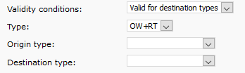

# Service fees

In the back office, go to **Prices -&gt; Service fees - agency**


If you use the Dealer module or if you need to define a service fee for a specific customer, see more details in **Service fees - dealer** at the end of this chapter.


To add a new service fee, click on:

## 1. Select carrier

You don't need to select any carrier, in which case the rule applies for all carriers.

| Item | Description |
| :--- | :--- |
| **Carrier** | Selection of a carrier for which the rule applies |
| **Connector** | Air Ticket Galileo - fees for tickets from Galileo GDS |
|  | Travelfusion tickets - fees for tickets from Travelfusion |

## 2. Select validity conditions

| Item | Description |
| :--- | :--- |
| **Validity conditions** | Generic validity - valid without any limitations |

| Item | Description |
| :--- | :--- |
| **Validity conditions** | Valid for destinations - limits the validity to specified types of journeys and connections |
| **Type** | OW+RT - valid for one-way and return journeys |
|  | OW - valid for one-way journeys |
|  | RT - valid for return journeys |
|  | These rules are not applicable for open-jaw journeys. For those you can only use rules with generic validity \(see above\). |
| **Origin \(IATA code\)** | Where the journey starts |
| **Destination \(IATA code\)** | Where the journey ends / Where the passenger returns from |

| Item | Description |
| :--- | :--- |
| **Validity conditions** | Valid for destination types - limits the validity to groups of destinations |
| **Type** | OW+RT - valid for one-way and return journeys |
|  | OW - valid for one-way journeys |
|  | RT - valid for return journeys |
|  | These rules are not applicable for open-jaw journeys. For those you can only use rules with generic validity \(see above\). |

## 3. Set up the service fee

| Item | Description |
| :--- | :--- |
| **Set fee value** | Fixed fee - a fixed amount in your default currency |
| **Fixed fee** | Numerical value of the fee |

| Item | Description |
| :--- | :--- |
| **Set fee value** | Fixed fee based on the ticket price - fixed amount added, if the price is within a predefined range |
| **Fixed fee** | Numerical value of the fee |
| **Fot tickets with prices from** | The lowest price of the ticket. The fee is applied for prices above this value. |
| **For tickets with prices to \(incl.\)** | The highest price of the ticket \(inclusive\). The fee is not applied for prices above this value. |
| **Price range includes taxes** | Prices of the tickets are considered including the taxes |


Note: GOL IBE always applies the most specific rule. For example, if you set up a rule with generic validity without specifying a carrier, and you at the same time set up a rule with a specified carrier, the second one is applied, if the carrier matches.


## Service fees for dealers and logged in users

If you use the Dealer module or if you need to define a service fee for a specific customer, go to **Prices -&gt; Service fees - dealer**

You will find the same settings as in **Service fees - agency**, and something extra.

**This settings is relevant in two basic situations:**

a\) **You have more Dealers \(websites\)** and you want to define a different service fee for each of them.

| Item | Description |
| :--- | :--- |
| **Dealer** | Selection for which dealer the settings applies |

b\) **You have a registered customer** and you want to define a specific service fee for them. You would usually do this, if you have an important customer \(or a company\) with whom you've negotiated special terms and a special service fee.

| Item | Description |
| :--- | :--- |
| **Customer validity** | General valid - not limited to a particular customer |
|  | Valid for chosen one - a specific registered customer whom you can select from the list. |


The total amount of the fee is a combination of the fees set up for the agency and the dealer. If you want to set up fees only for dealers and you don't want any basic agency service fee, go to _Service fees - agency_ and set the fee value to 0.


