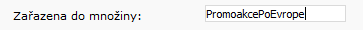

# Vložení seznamu promoakcí

Podrobnosti o implementaci speciálních nabídek najdete taktéž na [https://xxxx.golibe.com/gol-js/](https://xxxx.golibe.com/gol-js/), kde xxxx je označení URL pro vaši implementaci GOL IBE. Máte několik možností, jak implementovat:

## 1. Jednoduché vkládání

Pro jednoduché vložení postačí použít následující script. V případě zájmu o jiný jazyk je třeba tento jazyk zavolat názvem souboru se scriptem. Například: **gol-js-loader\_en.js** pro Angličtinu a **gol-js-loader\_ru.js** pro Ruštinu apod.

```markup
<script type="text/javascript" src="https://xxxx.golibe.com/gol-js/gol-js-loader_en.js"></script>
```


Pokud by se v HTML našel prvek s id="GOLJS\_SpecialOffers", bude seznam Promoakcí vložen do něho místo za loadovací script. Pozor, toto řešení nepřepíná jazyky - destinace a státy se budou vracet v defaultním jazyce.


## 2. Konfigurované vkládání, selektivní výběr zobrazených Promoakcí, vytažení Promoakcí podle názvu.

V tomto případě je vkládán seznam Promoakcí za pomoci následujícího konfigurovatelného scriptu:

```markup
<script type="text/javascript">
 var GOLJS = {
   dontLoadCss: true,                        // Přepínač, zda se má použít defaultní CSS, nebo nikoliv, a stylování si provede sám webdesignér.
   includeTags: ['tag1', 'tag2'],                // Názvy promoakcí, které mají být vybrány (nutno zadat u Promoakce), např. Asie
   excludeTags: ['tag3'],                        // Lze použít i opačnou logiku, vložit všechny mimo vyjmenovaných.
   tmpl: {
     specialOffers: // ...jQuery.tmpl() template...lze si připravit vlastní jQuery template.
   }
   specialOffersTag: '.mojeUmisteni' // vytvoření třídy, může být libovolný jQuery selektor, default je #GOLJS_SpecialOffers
 }
</script>
```

Příklad:  
Nejjednodušší případ vkládající do stránky pouze jednu Promoakci s názvem \(množinou\): "PromoakcePoEvrope"

```markup
<html>
       <head>
       <meta http-equiv="content-type" content="text/html; charset=utf-8" />

       <script type="text/javascript">
               var GOLJS = {
                       dontLoadCss: false,
                       includeTags: ['PromoakcePoEvrope']
               }
       </script>
       </head>
       <body>
               <script type="text/javascript" src="https://xxxx.golibe.com/gol-js/gol-js-loader_cz.js"></script> // kde xxx je URL základního FE.
       </body>
</html>
```

Názvů \(množin\) promoakcí je možné vkládat do scriptu více najednou. Názvy \(množiny\) se vkládají přes administrační zázemí v sekci: **Ceny -&gt; Promoakce - letenky \(rozšířené\)**

Zrovna tak každá Promoakce může mít nastaveno více Názvů \(množin\), je tedy možné na webu zobrazovat jen chtěné skupiny:



## 3. Vlastní vkládání

Poslední možností je stáhnout si seznam promoakcí a zpracovat si ho podle svých představ.

```http
http://xxxx.golibe.com/json/special-offers-list/en //kde xxxx je URL vašeho GOL IBE a /en je kód jazyka
```

